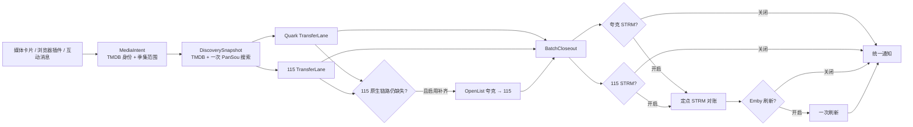
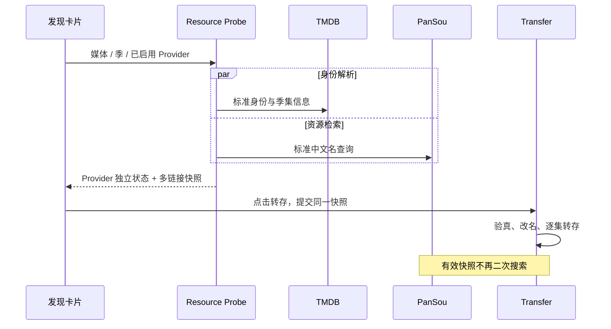
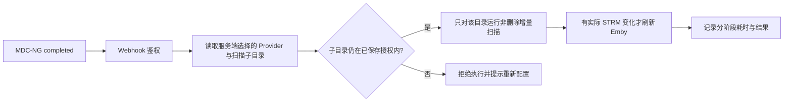

# MediaIndex 发现、转存与入库链路审计

> 审计日期：2026-08-28  
> 代码基线：GitHub Release `v0.6.21` / `main`，共同指向 `0da3faa535e03d5dd1844a4560a95857175a13ea`  
> Primary Module：`transfer`  
> Changed Modules：`discover`、`tracking`、`cloud`、`openlist`、`strm`、`integrations`、`settings`、`activity`

本文以用户提出的使用目标为需求，以最新代码、配置和测试为事实依据。其他历史文档只用于帮助理解现状，不能覆盖用户需求或最新代码行为。

## 1. 结论

这次整理不应把所有入口合并成一条庞大的自动化，而应建立一个共享的“媒体规划内核”，再让四条执行链路保持清晰边界：

1. **发现与原生转存**：一次取得 TMDB 身份和 PanSou 资源快照；夸克、115 各自建立并执行转存计划。
2. **智能追更**：复用同一媒体身份与集数计划，首轮转存后只继续检查尚未播出或尚未取得的集数。
3. **OpenList 补齐**：不参与发现，只在“夸克已经成功、115 仍缺失”时执行夸克到 115 的补偿复制。
4. **云下载整理与 Webhook 入库**：复用身份、集数、命名和后处理合同，但各自保留独立的来源授权与执行器。

115 的“优先”应体现为默认顺序、媒体库主视角和补齐目标，不应把两个网盘串成互相等待的依赖。只有 115 的用户、只有夸克的用户，以及同时启用两个网盘的用户，都必须能独立完成“发现 → 改名转存 → 可选 STRM → 可选 Emby → 通知”。

## 2. 本轮发现的主要断点

### 2.1 发现快照没有成为转存计划

`v0.6.21` 的资源预搜索能够展示候选，但卡片提交时只把首选链接当作提示，并允许执行阶段再次搜索。因此用户看到“可转存”后点击，后台仍可能重新搜索、改变候选或等待超时。多个单集链接也没有作为同一批计划完整传递。

### 2.2 PanSou 与 TMDB 的等待和查询被重复

资源探测先搜索 PanSou，再解析 TMDB 身份；同时启用夸克和 115 时，两条独立探测还可能发起相同的 PanSou 网络轮询。查询规划包含别名、英文名、年份、期数和日期等大量排列，增加了延迟和误命中，却未明显提高中文资源召回率。

### 2.3 OpenList 的职责与基础转存混在一起

OpenList 只能解决已挂载存储之间的复制，不能替代夸克或 115 原生分享转存。把它放进发现流程或全局设置，会让用户误以为双网盘必须串行执行，也让单网盘流程承担无关配置。

### 2.4 云下载整理重复了媒体规划，但来源语义不同

`cloud_download_organizer` 已有完整的 TMDB 匹配、季集识别、命名、目标预检和后处理流程。它与发现转存确有大量同构算法，但前者面对“已落入暂存目录的文件”，后者面对“尚未转存的分享资源”。直接合并执行器会混淆授权、幂等和清理边界。

### 2.5 Webhook 退化为已保存范围的整体增量扫描

当前正式版忽略 MDC-NG 回传的完成路径，只按整个已保存媒体范围运行增量 STRM。虽然安全且稳定，但一个文件或一个媒体目录完成后仍可能枚举整库，延迟来自网盘目录读取、STRM 对账和后续 Emby 刷新叠加，任务结果也无法明确指出哪个阶段耗时。

### 2.6 导航不再对应真实业务边界

OpenList 设置位于全局设置，Webhook 深藏于通知设置，云下载入口和互动链接入口也分散。用户难以从导航判断“这是资源输入、原生转存、跨盘补齐，还是入库后处理”。

## 3. 目标领域模型



### 3.1 `MediaIntent`

统一表示用户想处理的媒体，不携带某个入口独有的 UI 状态：

- TMDB 类型和 ID；
- 标准中文名、年份；
- 电影或季号；
- TMDB 总集数、截至当前已播集数；
- 用户选择的集数范围；
- 来源入口和用户显式动作。

### 3.2 `DiscoverySnapshot`

一次预搜索的不可变结果：

- 解析后的 `MediaIntent`；
- 实际使用的规范查询词；
- 原始 PanSou 结果及时间戳；
- 按 Provider 过滤后的分享链接列表；
- 可识别的整季包、单集覆盖和缺集；
- 证据等级与是否可直接执行；
- 快照过期时间。

快照是“用户看到什么，就按什么执行”的合同。卡片直接转存不得在快照仍有效时重新搜索；显式刷新、加入智能追更后的下一轮检查，才可以取得新快照。

### 3.3 `TransferLane`

每个启用网盘各自拥有一条计划和状态机：

```text
idle → probing → ready → transferring → verifying → post_processing → completed
                  └→ unavailable                         └→ partial / failed
```

必须保存 Provider、目标目录、分享链接集合、预计集数、实际覆盖、成功集数、失败集数和后处理策略。夸克失败不能阻塞 115；115 没有候选也不能让夸克等待。

### 3.4 `BatchCloseout`

批次只负责等待“本轮已经计划的项目”进入终态，不等待未知资源，也不猜测以后是否会出现：

- 预计已播 20 集，快照找到 20 集：执行 20 集后统一收口；
- 预计已播 20 集，只找到 18 集：执行 18 集后立即收口，并记录缺 2 集；
- 整季包可验证覆盖所选范围：作为一个资源执行，但仍以逐集覆盖结果结算；
- 一个 Provider 未启用 STRM：该 Provider 在转存核验完成后结束；
- 启用 STRM 的 Provider：只对本批已核验资产做定点对账；
- Emby 与用户通知在本批后处理结束后各执行一次。

### 3.5 `CompensationPlan`

OpenList 只接收明确的差集：

```text
quark_verified_assets - p115_verified_assets = assets_to_compensate
```

它不搜索资源、不决定媒体身份、不代替原生转存，也不把 115 失败改写成夸克成功。自动补齐只允许夸克到 115；反向和未来其他 Provider 应作为新的显式能力设计。

## 4. 发现到转存的执行规则

### 4.1 一次搜索同时完成身份和资源准备



本轮实现采用短时单航班缓存：同一页面并发探测夸克和 115 时，共享一次 PanSou 网络查询结果，但两条 Provider 后续过滤、验证和转存仍彼此独立。用户显式刷新会开启新一代快照；同一次刷新产生的并发 Provider 请求仍会合并。

### 4.2 查询策略

资源查询按以下上限执行：

- 电影：`中文标准名`，必要时补 `中文标准名 年份`；
- 剧集/综艺/动漫：`中文标准名`、`中文标准名 第N季`、`中文标准名 SNN`；
- 不自动轮询英文名、繁体名、所有别名、单集号、播出日期或期数排列；
- 别名仍可用于结果身份判断，但不应默认扩散查询。

如果未来数据证明某一来源必须使用别名，应把它做成来源级、可观测的受控回退，而不是恢复全排列搜索。

### 4.3 多链接与整季包

探测结果需要把同一搜索快照中的所有兼容链接传给转存服务，而不是只保留第一条：

- 多个单集链接按缺集计划逐一消费；
- 一个链接可覆盖多集时，只转存一次并按实际目录结果核验覆盖；
- 候选失败后继续尝试快照中的下一条；
- 冻结快照耗尽后本轮结束，不在后台悄悄开始新搜索；
- 智能追更下一轮可以显式刷新并取得新快照。

### 4.4 “转存全部”与“加入智能追更”

- **单个网盘转存**：只提交该行已经验证可用的快照。
- **转存全部**：并行提交当前已经验证可用的 Provider/季计划；不为“当前无资源”的网盘创建等待任务。
- **加入智能追更**：等于执行当前可用计划，并为所有已启用 Provider 独立登记后续检查；当前无资源的网盘可在未来轮次继续寻找。
- **115 优先**：115 行默认靠前、作为核心媒体库目标；不改变并行和独立结算语义。

### 4.5 卡片信息层级

媒体卡片应只保留对当前决策有用的信息：

1. 媒体与季信息；
2. 资源简报，例如“已播 20/30 · 可转 18 · 缺 2”；
3. 每个已启用网盘一行：转存、打开、分享、STRM 状态；
4. “转存全部”和“加入智能追更”；
5. 当前正在运行时才显示链路状态，空闲时隐藏。

交互沿用现有视觉语言，并按 `emilkowalski/skills` 保持短促、可中断、尊重 `prefers-reduced-motion` 的状态反馈；本轮不引入新的视觉主题。

## 5. OpenList 独立补齐

### 5.1 页面职责

OpenList 应是与发现、订阅追更同级的顶层页面，名称明确为“OpenList 跨盘补齐”。该页包含：

- OpenList 启用与连接测试；
- URL、Token、夸克挂载路径、115 挂载路径；
- 夸克到 115 自动补齐开关；
- 手动浏览、选择和复制；
- 补齐队列、结果和失败原因。

全局设置不再重复维护 OpenList 配置。旧路由继续兼容，但跳转到新页面。

### 5.2 自动补齐触发条件

只有以下条件同时满足才进入自动补齐：

1. 用户同时启用夸克与 115 的相关追更计划；
2. 夸克目标资产已核验成功；
3. 115 原生转存对同一精确集数仍为缺失或失败；
4. 该季显式开启 OpenList 补齐；
5. OpenList 连接和两侧路径映射有效；
6. 不存在同一资产的活动补齐任务。

OpenList 失败只影响补齐步骤，不回滚夸克成功结果，也不重复提交已失败的 115 原生分享转存。

## 6. 云下载整理：共享算法，隔离执行

### 6.1 评估结论

云下载整理不应与发现转存合并成同一工作流，但应逐步抽取共同的纯规划能力。两条流程的差异是安全边界，不是偶然实现差异。

| 能力 | 可以共享 | 必须隔离 |
| --- | --- | --- |
| TMDB 标准身份、标题别名判断 | 是 | 不同入口提供不同证据 |
| 已播/目标/缺失集数模型 | 是 | 云下载还需从实际文件反推覆盖 |
| 电影、季目录和文件命名计划 | 是 | 云下载要处理字幕/NFO 和现有文件 |
| 目标冲突预检 | 是 | Provider 写入和来源清理分别执行 |
| STRM、Emby、通知策略 | 是 | 每条链路提交自己的精确资产回执 |
| PanSou 搜索与分享链接验真 | 否 | 只属于发现/转存 |
| 云下载目录扫描、稳定等待 | 否 | 只属于云下载整理 |
| 移动后精确清理来源文件 | 否 | 只属于云下载整理，且必须 fail closed |

### 6.2 推荐的共享“Media Planning Kernel”

后续按小步迁移，建立不直接访问 HTTP、数据库或 Provider 的纯领域服务：

```text
SourceEvidence
  → MediaIdentityResolver
  → EpisodeCoveragePlanner
  → CanonicalNamingPlanner
  → DestinationPreflight
  → PostPolicy
  = ImmutableMediaPlan
```

发现链路由 `ShareResourceAdapter` 产生 `SourceEvidence`，云下载由 `CloudStagingAdapter` 产生；各自的执行器只消费不可变计划。这样可以复用判断和命名，又不允许云下载的扫描/清理权限泄漏到普通分享转存。

### 6.3 已实施边界

本轮已提取无副作用的 `media-plan/v1`：统一媒体身份、正集数归一、`total / aired / available / transferred / missing / pending_transfer` 覆盖率以及首选分享链接。发现页、批量转存、企微/Telegram 和云下载整理计划都消费该合同；浏览器插件可直接向现有转存接口提交同一对象，或先调用 `/api/transfers/plans/normalize`。

`cloud_download_organizer` 只复用纯规划结果，成熟的崩溃恢复、目标强绑定、复制/移动和清理门槛仍由原执行器独立拥有。短期发现快照继续使用内存 TTL，不新增持久化表。

## 7. Webhook 入口与固定目录增量 STRM

### 7.1 目标流程



### 7.2 请求合同

推荐请求：

```json
{
  "event": "finished"
}
```

`mdc_webhook_scan_path` 只能从所选 Provider 已保存的 STRM 子目录中选择。Provider 与扫描目录都取服务端配置；配置存在时，外部 Body 中即使包含路径也会被忽略。旧安装尚未选择该字段时继续兼容原安全路径映射。

### 7.3 执行语义

- Webhook 只表达“刮削完成”，不承担跨容器路径映射；
- 连续事件按 Provider + 固定扫描目录合并；
- 每轮只读取一个已授权目录，并运行增量而非全量；
- 增量任务不能推进 STRM 删除，也不能修改网盘文件；
- HTTP `202` 返回 `scope: configured_incremental`；有实际 STRM 变化时再通知 Emby。

## 8. 网盘工作台信息架构

网盘工作台一级目录固定为：

```text
网盘工作台
├── 网盘链接
├── 资源获取
├── 转存和整理规则
├── 云下载
├── Webhook
└── 任务中心
```

- **网盘链接**：Provider 启用、凭据、连接和目录能力；
- **资源获取**：PanSou、频道和其他资源来源；
- **转存和整理规则**：目标根、暂存、分类和命名；
- **云下载**：互动链接的暂存落点及云下载整理；
- **Webhook**：MDC-NG 与其他容器完成事件；
- **任务中心**：只读聚合任务状态，不承载执行语义。

OpenList 保持顶层页面，不进入工作台原生转存目录；通知设置只管理消息渠道，不再藏 Webhook 执行入口。

## 9. 本轮落地状态

| 项目 | 状态 | 说明 |
| --- | --- | --- |
| GitHub latest 基线核对 | 已完成 | `v0.6.21` 与 `main` 为同一提交，忽略旧工作区 |
| TMDB 与首轮 PanSou 并发 | 已完成 | 降低串行等待 |
| 双 Provider 共享一次 PanSou 网络快照 | 已完成 | 短时单航班；Provider 过滤和执行仍独立 |
| 规范中文查询策略 | 已完成 | 仅标准名、季标记和必要年份 |
| 预搜索多链接直接进入转存 | 已完成 | 新增多链接合同并保留单链接兼容 |
| 卡片点击不再二次搜索 | 已完成 | 已验证快照使用冻结计划；显式追更轮次可刷新 |
| 剧集资源简报 | 已完成 | 卡片按 Provider 显示 TMDB 总集数、已播、可转和缺失数量 |
| “转存全部”只执行当前可用计划 | 已完成 | 不为无资源 Provider 建立等待任务 |
| 点击后显示独立网盘链路 | 已完成 | 单盘或全部转存启动后才展开；未启动网盘明确标记，执行互不阻塞 |
| 提交网盘与落盘确认分离 | 已完成 | 原生夸克/115 和 QAS 以目标目录核验推进；外部执行端不伪装成已落盘 |
| 独立网盘批次收口、STRM/Emby/通知 | `v0.6.21` 已有并增强 | 保留原有收口，在可视流程中增加真实落盘节点 |
| OpenList 独立顶层设置与页面 | 已完成 | 自动方向固定为夸克到 115 补齐；旧路由兼容跳转 |
| 工作台六个一级入口 | 已完成 | Webhook 从通知设置移出 |
| Webhook 固定目录增量扫描 | 已完成 | 外部只发完成信号；目录由服务端预选，旧路径模式继续兼容 |
| Webhook 重启恢复保持保存范围 | 已完成 | 恢复时重新核验当前固定目录授权 |
| 云下载共享规划内核 | 已完成 | 复用纯身份、集数、覆盖率和计划合同；远端执行与恢复仍独立 |
| 短期 `DiscoverySnapshot` 与覆盖率读模型 | 已完成 | 内存 TTL 符合使用边界，不做长期持久化 |
| 发现、互动与浏览器插件计划协议 | 已完成 | `media-plan/v1` 兼容现有转存接口；latest 仓库不含插件源码 |

## 10. 兼容性与安全边界

- 数据库：本轮不新增 migration，不改变既有任务表语义。
- API：新增 `preferred_share_urls`，保留 `preferred_share_url`；旧客户端继续可用。
- 资源状态：新增 `transfer_share_urls` 和 `plan_reusable`，均为向后兼容的可选字段。
- 配置：新增 `mdc_webhook_scan_path`，旧 `mdc_webhook_root_path` 继续读取以兼容未迁移安装。
- 路由：旧 OpenList 和 Webhook hash 路由自动跳转到新入口。
- Provider：夸克与 115 的凭据、目录、执行、失败、STRM 和追更状态始终独立。
- 路径：Webhook 固定目录只能取已保存授权；云下载移动清理只针对重新核验的精确文件 ID。
- 删除：定点或增量 STRM 不执行清理；OpenList 和 Webhook 都不能删除网盘资产。

## 11. 下一阶段优先级

### 已完成：覆盖率与纯媒体规划内核

`media-plan/v1` 已成为发现、转存入口和云下载整理的统一读模型。发现计划按产品使用方式保持短期 TTL，不建设长期持久化快照；后续只需在浏览器插件源码并入 latest 仓库时补其端到端固定夹具。

从云下载整理和发现转存中先提取身份、覆盖和命名的纯函数。每一步都用现有电影、剧集、综艺、字幕、冲突和歧义样本做双实现对照，行为一致后再切换调用方。

### P2：链路可观测性

为每批记录统一阶段时间：`discover`、`verify`、`transfer`、`organize`、`strm`、`emby`、`notify`、`openlist`。任务中心按用户动作聚合 Provider 子任务，同时保留每条网盘独立失败原因。

### P2：OpenList 差集资产合同

把追更当前按季的补齐输入升级为精确资产差集，记录源 Provider 文件身份、目标相对路径和已存在判断；自动补齐严格去重，手动补齐仍要求用户确认方向与目标。

## 12. 验收标准

### 发现与转存

- 同一媒体详情同时探测夸克和 115 时，PanSou 只发生一轮等价网络查询；
- 卡片显示可转后点击，不再发起第二轮搜索；
- 18 个单集链接能作为一个批次按缺集顺序执行；
- 整季包只提交一次，最终按实际集数覆盖结算；
- 夸克失败不阻塞 115，反之亦然；
- “转存全部”不等待当前没有候选的网盘；
- 智能追更会继续检查尚未取得或尚未播出的集数；
- STRM 关闭时转存即终态，开启时只处理本批已核验资产；
- 用户只收到一次包含成功数与缺集数的批次通知。

### OpenList

- 发现和普通单次转存不触发 OpenList；
- 只有夸克成功且 115 同一资产缺失时才可自动补齐；
- OpenList 失败不回滚或重复夸克原生任务；
- 所有 OpenList 设置、测试、手动复制和队列都能在同一顶层页面完成。

### 云下载

- 继续只处理明确事件目标或已授权定时范围；
- TMDB 歧义、未匹配视频、目标冲突和身份变化均 fail closed；
- 移动模式只按重新核验的文件 ID 清理，不回收整个来源目录；
- 后续抽取共享规划内核时，现有恢复和清理合同不能改变。

### Webhook

- 外部请求只需发送完成事件，不要求携带文件路径；
- 每次只对网页预选且仍在授权中的一个 STRM 子目录运行增量；
- 连续事件按固定目录合并，进程重启后重新核验当前保存范围；
- 有 STRM 新增或更新时再通知 Emby；
- 未迁移旧配置继续支持原来的安全路径映射。

## 13. 发布边界

本轮只在最新基线工作区完成代码、测试和文档整理。未创建 Git commit，未 push，未创建 PR，也未发布镜像或 Release；这些外部动作需要单独明确授权。

## 14. 验证记录

- 后端全量测试：以本轮最终回归记录为准；仅保留第三方 Starlette/httpx 弃用提示。
- 前端 TypeScript project build：通过。
- 前端 Vite production build：通过；保留既有的单 chunk 超过 500 kB 提示。
- `git diff --check`：通过；Windows 工作区仅提示 Git 后续可能按配置转换 CRLF。
